# Education Platform

Desktop learning management system built with WPF using the MVVM pattern.

The project was created to practice the MVVM architecture, building applications with WPF and working with SQLite database using Entity Framework Core.

## Overview

The application is designed to support the educational process by managing users, tests and learning materials.

## Features

- Registration and authorization
- Dashboard with information panel
- Profile avatar selection
- Changing username
- Users management
- Creating tests
- Multiple question types
- Previewing tests before taking them
- Taking tests
- Automatic test evaluation
- Viewing results
- Detailed review of completed tests
- Detailed review of test attempts
- Creating materials
- Uploading files to learning materials
- Viewing materials

## User Roles

In application includes 3 roles.

Any role can Logout from account, editing its profile and, if necessary, view a test or material.

Each role has its own set of capabilities and operational distinctions

### Administrator

The administrator manages users (deleting, searching, changing role).

### Teacher

The teacher can:

- create tests;
- edit and delete their own tests;
- sort tests;
- view students' results;
- review individual test attempts;
- manage learning materials. 

### Student

The student can: 
- take tests; 
- view results for each attempt;
- study the materials.

## Technologies

- C#
- WPF
- SQLite
- Entity Framework Core
- MVVM Toolkit
- BCrypt.Net
- Material Design in XAML

## Architecture

The application follows the MVVM (Model–View–ViewModel) architecture.

- Views are responsible for the user interface.
- ViewModels contain presentation logic.
- Models represent application data.
- Services contain business logic and database operations.


Business logic is separated into dedicated services such as:

- AuthService
- MaterialService
- TestService
- UserService
- ValidationService


Entity Framework Core is used for data access with SQLite.

The database contains separate entities for users, tests, questions, answers, results and materials.

## Screenshots

### Login

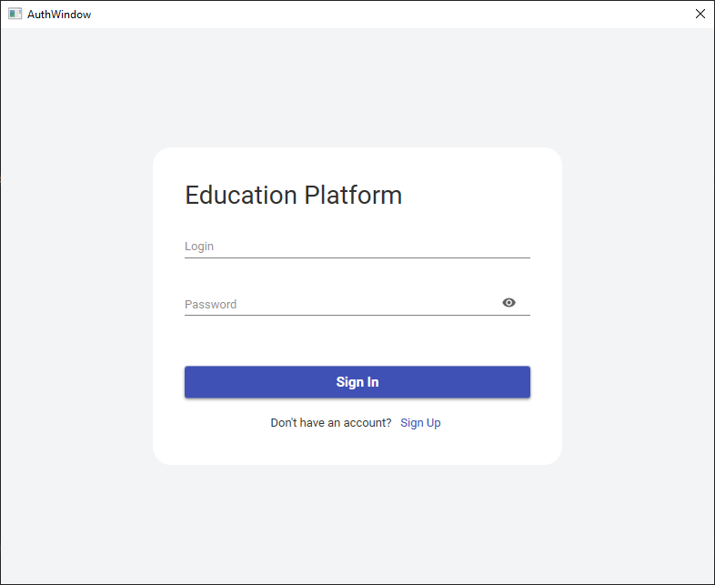

### Dashboard

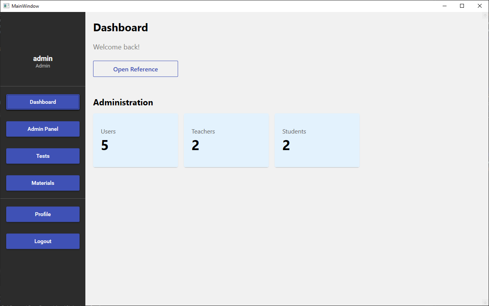

### User Management

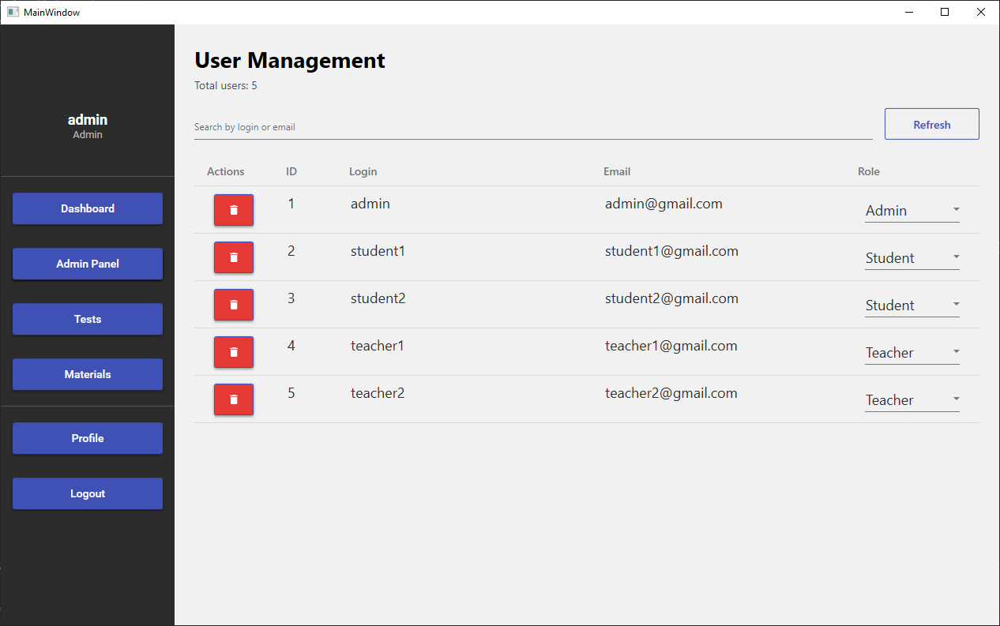

### Tests

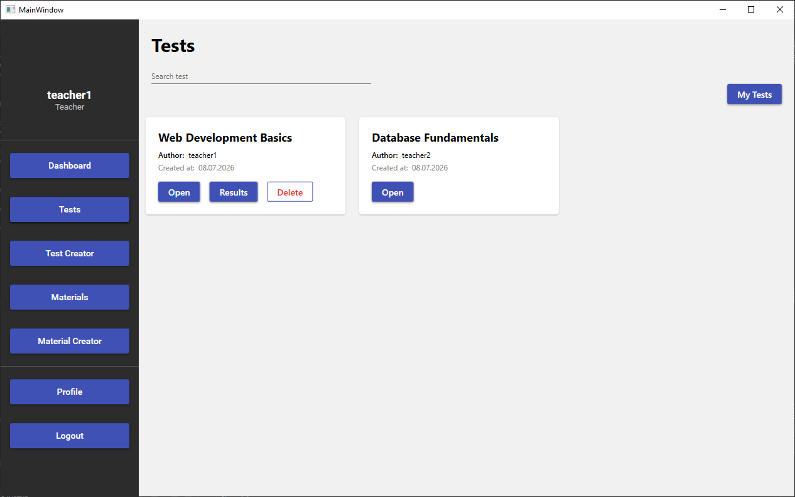

### Test Creation

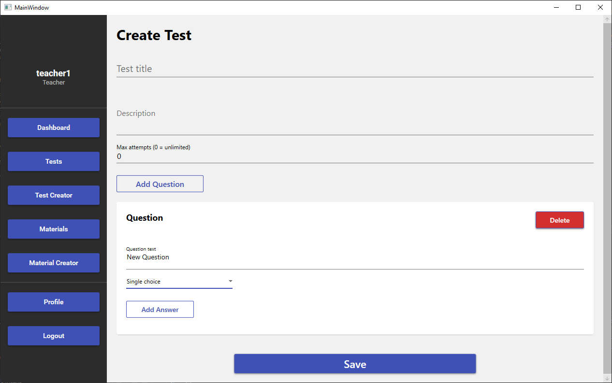

### Taking a Test

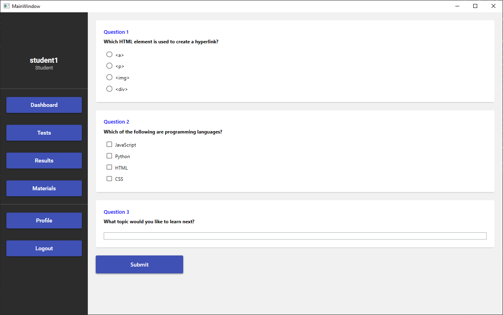

### Results

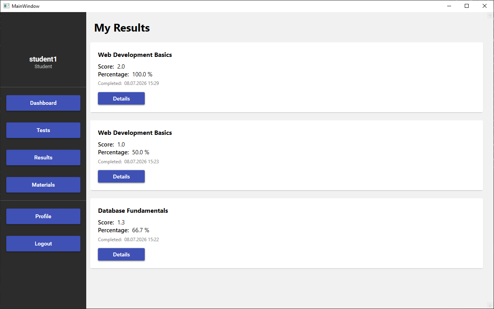

### Teacher results

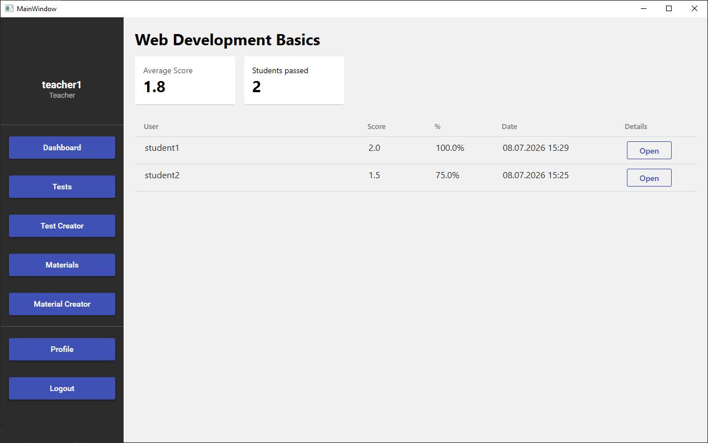

### Materials

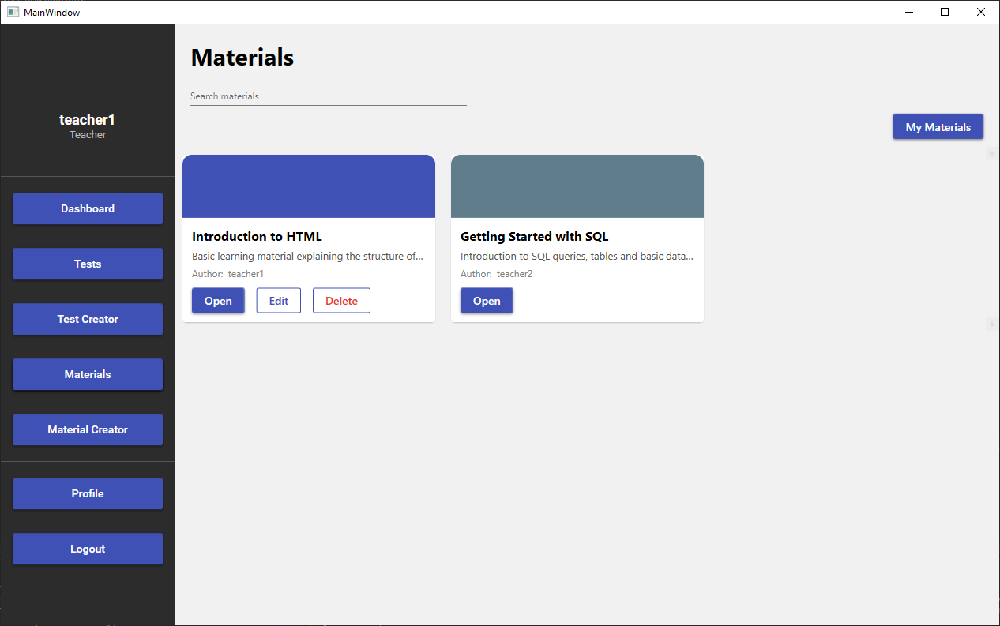

### Material Creation (Part 1)

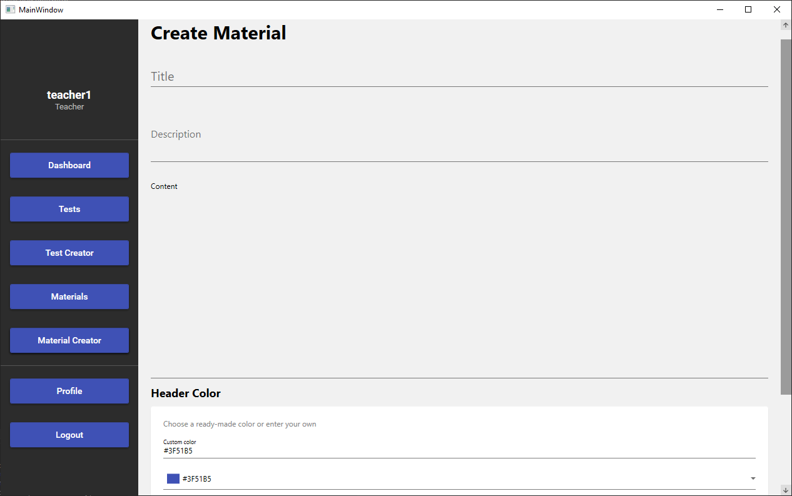

### Material Creation (Part 2)

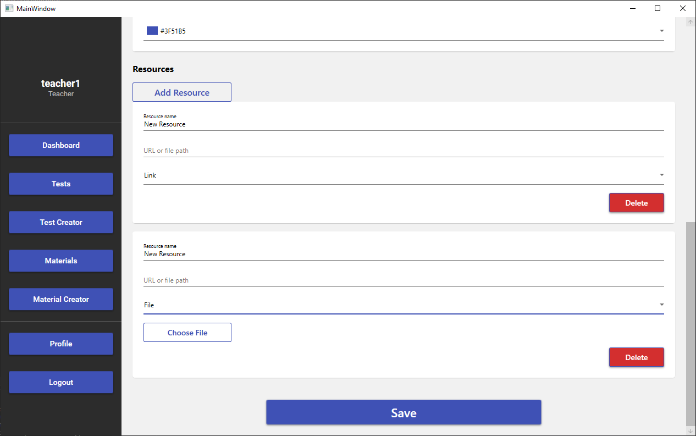

## Database

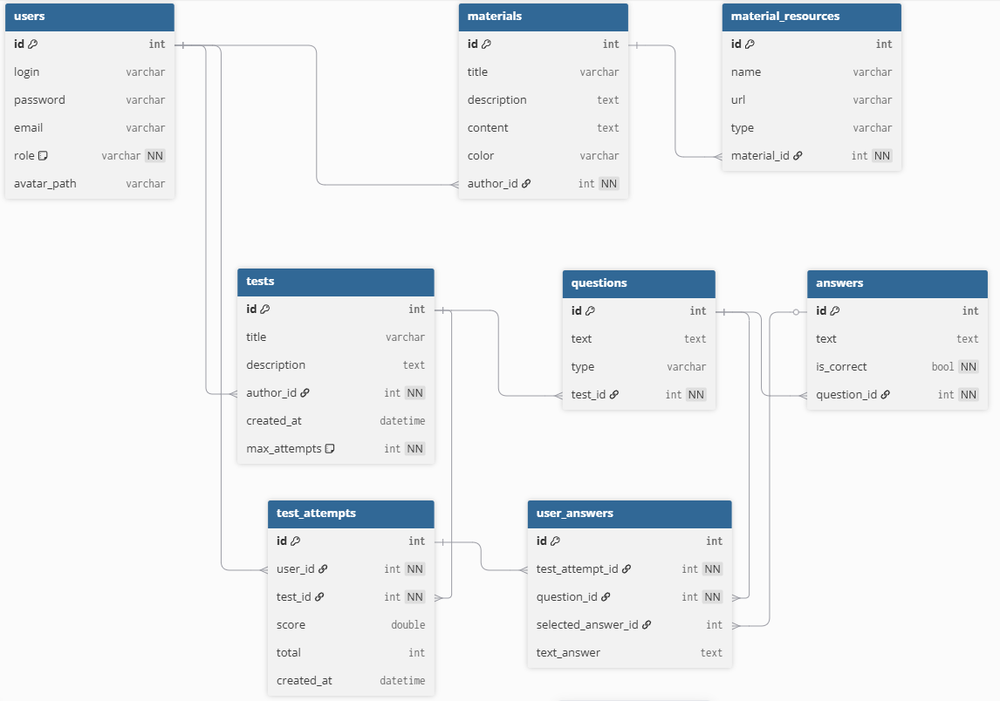

## Default Administrator

**Login**

```text
admin
```

**Password**

```text
Admin1!
```

## How to Run

1. Clone the repository.
2. Open the solution in Visual Studio.
3. Build and run the application.
4. On the first launch the database is created automatically.
5. Use the default administrator account to sign in.

## Future Improvements

- Migration to a client-server architecture using ASP.NET Core Web API.
- Replacing the local SQLite database with PostgreSQL.
- Development of a web version using Angular.
- AI-assisted evaluation of text-based answers.
- Additional question types and improved test editor.

## Author

Yehor Radykop